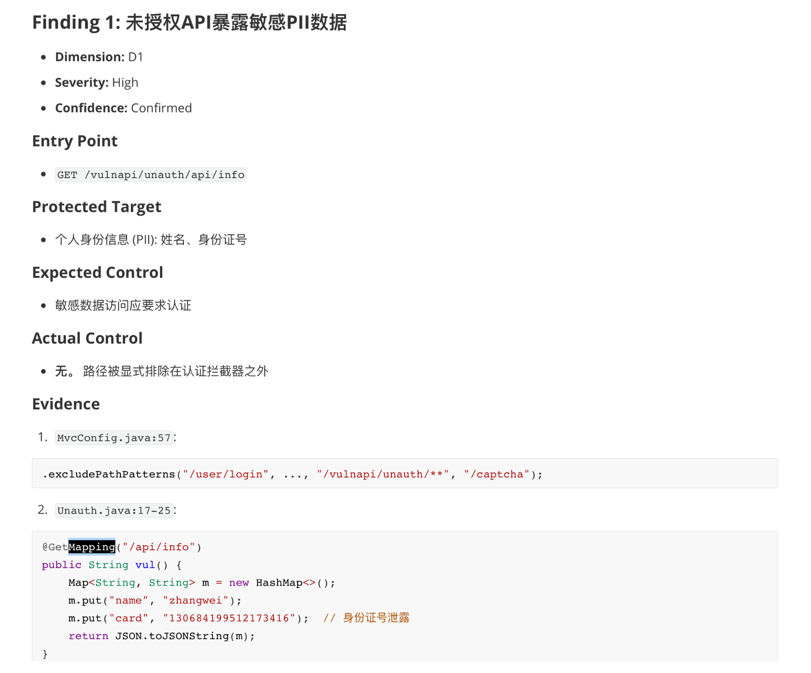

# AI Code Audit Skills Summary

## Description

This repository contains two parallel audit skill sets:

- `Sink_Audit_SKILL/`: sink-oriented vulnerability audit skills. These help verify whether untrusted data reaches dangerous operations without the required controls.
- `Source_Audit_SKILL/`: source-oriented audit skills. These help discover where security-relevant values enter the application, who controls them, how trusted they are, and which downstream sink or control should be audited next.

The source skills do not directly confirm vulnerabilities. They create structured source point inventories that can guide later sink-side validation.

## 1. Current Repository Architecture

```text
CodeAudit-Single_SKill/
├── Sink_Audit_SKILL/
│   ├── access-control-check/
│   │   ├── SKILL.md
│   │   └── references/
│   │       ├── common-cases.md
│   │       ├── java-cases.md
│   │       ├── php-cases.md
│   │       └── python-cases.md
│   ├── bussiness-logic-check/
│   │   ├── SKILL.md
│   │   └── references/
│   │       ├── authentication-cases.md
│   │       ├── common-cases.md
│   │       ├── payment-cases.md
│   │       ├── promotion-cases.md
│   │       ├── rate-limit-cases.md
│   │       ├── resource-consumption-cases.md
│   │       ├── third-party-integration-cases.md
│   │       └── workflow-cases.md
│   ├── deserialization-check/
│   │   ├── SKILL.md
│   │   └── references/
│   │       ├── common-cases.md
│   │       ├── java-cases.md
│   │       ├── php-cases.md
│   │       └── python-cases.md
│   ├── file-path-handling-check/
│   │   ├── SKILL.md
│   │   └── reference/
│   │       ├── common-cases.md
│   │       ├── java-cases.md
│   │       ├── php-cases.md
│   │       └── python-cases.md
│   ├── rce-check/
│   │   ├── SKILL.md
│   │   └── references/
│   │       ├── common-cases.md
│   │       ├── java-cases.md
│   │       ├── php-cases.md
│   │       └── python-cases.md
│   ├── sql-injection-check/
│   │   ├── SKILL.md
│   │   └── references/
│   │       ├── common-cases.md
│   │       ├── java-sql-cases.md
│   │       ├── php-sql-cases.md
│   │       └── python-sql-cases.md
│   ├── ssrf-check/
│   │   ├── SKILL.md
│   │   └── references/
│   │       ├── java-cases.md
│   │       ├── php-cases.md
│   │       └── python-cases.md
│   └── xss-check/
│       ├── SKILL.md
│       └── references/
│           ├── common-cases.md
│           ├── java-cases.md
│           ├── javascript-cases.md
│           ├── php-cases.md
│           └── python-cases.md
├── Source_Audit_SKILL/
│   ├── access-control-check/
│   │   ├── SKILL.md
│   │   └── references/
│   │       ├── common-cases.md
│   │       ├── java-cases.md
│   │       ├── php-cases.md
│   │       └── python-cases.md
│   ├── bussiness-logic-check/
│   │   ├── SKILL.md
│   │   └── references/
│   │       ├── authentication-cases.md
│   │       ├── common-cases.md
│   │       ├── payment-cases.md
│   │       ├── promotion-cases.md
│   │       ├── rate-limit-cases.md
│   │       ├── resource-consumption-cases.md
│   │       ├── third-party-integration-cases.md
│   │       └── workflow-cases.md
│   ├── deserialization-check/
│   │   ├── SKILL.md
│   │   └── references/
│   │       ├── common-cases.md
│   │       ├── java-cases.md
│   │       ├── php-cases.md
│   │       └── python-cases.md
│   ├── file-path-handling-check/
│   │   ├── SKILL.md
│   │   └── references/
│   │       ├── common-cases.md
│   │       ├── java-cases.md
│   │       ├── php-cases.md
│   │       └── python-cases.md
│   ├── rce-check/
│   │   ├── SKILL.md
│   │   └── references/
│   │       ├── common-cases.md
│   │       ├── java-cases.md
│   │       ├── php-cases.md
│   │       └── python-cases.md
│   ├── sql-injection-check/
│   │   ├── SKILL.md
│   │   └── references/
│   │       ├── common-cases.md
│   │       ├── java-sql-cases.md
│   │       ├── php-sql-cases.md
│   │       └── python-sql-cases.md
│   ├── ssrf-check/
│   │   ├── SKILL.md
│   │   └── references/
│   │       ├── common-cases.md
│   │       ├── java-cases.md
│   │       ├── php-cases.md
│   │       └── python-cases.md
│   └── xss-check/
│       ├── SKILL.md
│       └── references/
│           ├── common-cases.md
│           ├── javascript-cases.md
│           ├── java-cases.md
│           ├── php-cases.md
│           └── python-cases.md
├── Evidence/
├── Images/
└── README.md
```

## 2. Source Skill Summary

Each source skill mirrors the corresponding sink skill name under `Sink_Audit_SKILL/`, but changes the audit perspective:

```text
sink audit:   Can this value reach a dangerous operation without enough protection?
source audit: Where does this relevant value originate, who controls it, and what downstream sink or control should be checked next?
```

| Skill | Main Goal | Core Source Content |
|---|---|---|
| Access Control Source Check | Identify identity, role, object, tenant, relationship, and workflow-state sources that drive authorization decisions. | Principal sources, route/object IDs, tenant selectors, ownership attributes, delegated actors, policy context, client-supplied auth context. |
| Business Logic Source Check | Identify business-state, actor, amount, quota, workflow, callback, promotion, and integration inputs that can influence business rule execution. | Payment values, account binding, rate/quota keys, state transition inputs, promotion claims, resource usage requests, third-party events. |
| Deserialization Source Check | Identify serialized payload sources and type-selection inputs that may reach object restoration paths. | Request bodies, cookies, queues, cache records, files, session data, polymorphic type fields, framework binder inputs. |
| File Path Handling Source Check | Identify path, filename, archive entry, storage key, and resource locator sources that may influence file operations. | Upload names, download paths, template names, include paths, object keys, archive entries, symlink-adjacent paths. |
| RCE Source Check | Identify command, interpreter, script, template, plugin, expression, and external-tool inputs that may influence execution behavior. | Process arguments, shell fragments, eval expressions, template code, job payloads, environment/config values, tool options. |
| SQL Injection Source Check | Identify query-shaping values that may influence SQL text, structure, identifiers, filters, ordering, or ORM criteria. | Request filters, sort/order fields, dynamic table/column names, raw fragments, imported values, second-order query inputs. |
| SSRF Source Check | Identify URL, host, IP, callback, webhook, proxy, fetch, import, and redirect-controlled inputs that may influence outbound requests. | User URLs, avatar/image fetches, webhooks, integrations, preview/import jobs, metadata-like targets, DNS/redirect-influenced values. |
| XSS Source Check | Identify browser-rendering-relevant inputs that may flow toward server-rendered pages, DOM rendering, rich text, Markdown, or frontend raw rendering. | Reflected request values, stored content, template model values, API-to-frontend fields, browser-side sources, trusted/safe HTML markers. |

## 3. Usage Verification

### Access Control Source Check

/Evidence/access-control-audit-report-v2.md



---

## Need Your Help

Still developing，please give a **star**🌟 if it helps. Most of this project was completed with the help of AI, so  if it succeeds or fails, please file an issue for me.
